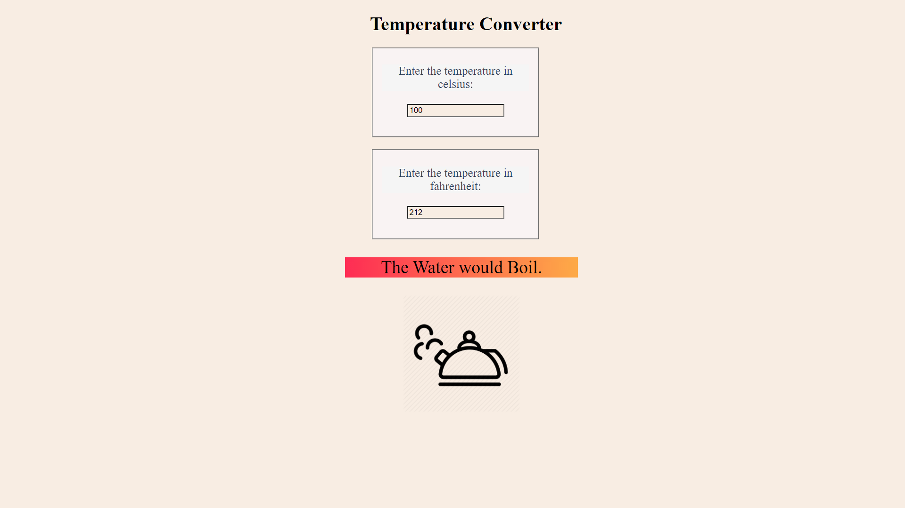

# Temperature Converter  

**The temperature converter is made from react and it changes the temperature in celsius and fahrenheit synchronously.**  
-------------------------------------------------------------------

### This allows user to give input in both field(celsius and fahrenheit).  
### You can check this site [here.](https://t-conv.netlify.app/)

# To Run the code on your system: 

1. *Clone the code 💻*  

2. *Install all the dependencies ⏰*  

3. *Run(🏃) the code with npm start*
